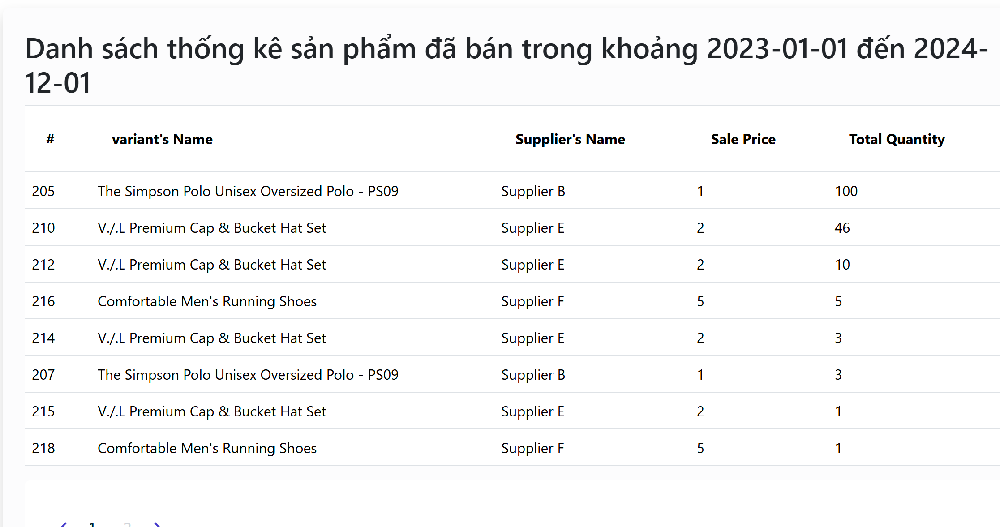
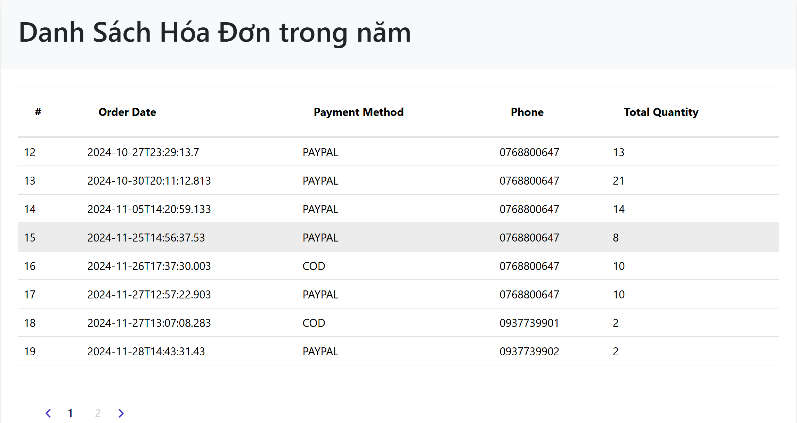
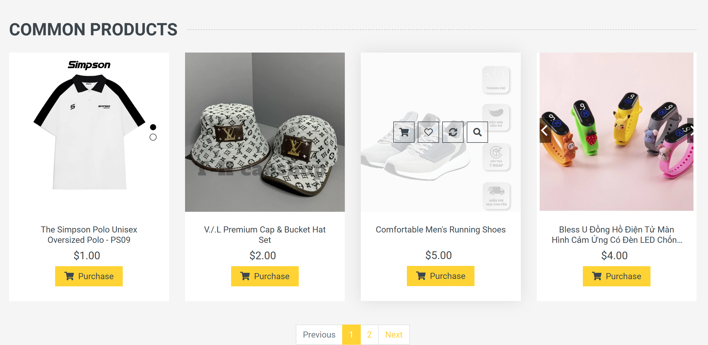

<h1>NHÓM 22: Xây dựng website thương mại điện tử(thời trang)</h1>
## Overview
 ◦ Built an eCommerce platform for a fashion store, enabling product browsing, purchases with multiple
variants (e.g., size, color), and features like product detail pages, previews, and a shopping cart.
◦ Implemented secure user authentication with JWT tokens.
◦ Integrated Cash on Delivery (COD) and PayPal APIs for diverse payment options.
◦ Created an admin dashboard to manage banners, categories, and product variants .

<h3>Languages and Tools:</h3>
  <a href="https://getbootstrap.com" target="_blank" rel="noreferrer">
    
  </a>
  <a href="https://www.w3schools.com/cs/" target="_blank" rel="noreferrer">
    
  </a>
  <a href="https://www.w3schools.com/css/" target="_blank" rel="noreferrer">
    
  </a>
  <a href="https://dotnet.microsoft.com/" target="_blank" rel="noreferrer">
    
  </a>
  <a href="https://www.w3.org/html/" target="_blank" rel="noreferrer">
    
  </a>
  <a
    href="https://www.microsoft.com/en-us/sql-server"
    target="_blank"
    rel="noreferrer"
  >
    
  </a>
  <a href="https://nodejs.org" target="_blank" rel="noreferrer">
    
  </a>
  <a href="https://reactjs.org/" target="_blank" rel="noreferrer">
    
  </a>
  <a href="https://www.typescriptlang.org/" target="_blank" rel="noreferrer">
    
  </a>
</p>
<span>
## Features  
🌟 **Authentication & Authorization**  
🌟 **Session Management**  
🌟 **Banner Management**  
🌟 **Product Management**  
🌟 **Variant Management**  
🌟 **Category Management**  
🌟 **Cart Management**  
🌟 **Order Management**  
🌟 **Customer Management**  
🌟 **Supplier Management**  
🌟 **Analytics & Reporting**  
🌟 **Feedback & Reviews**  
🌟 **Payment Integration**  
🌟 **Sales Features**  
</span>

## Built with


## Run project

### Requierment

- Dotnet version 8 or later
- Nodejs v20.15.0 or later

### Installation

1. Clone this project

```bash
# Include Backend, Frontend
git clone https://github.com/DuyTranNhat/MutiFashion/


```

2. Run server (You can do this step on IDE like Visual Studio)
   Change connectionString on MutiFashion\Server\appsettings.json

```json

"ConnectionStrings": {
    "Connection": "Data Source=[YOUR_SERVER_NAME];Initial Catalog=MutiFashion;Integrated Security=True;Encrypt=True;Trust Server Certificate=True"
  }
```

If your use user-password server

```json
    "ConnectionStrings":  {
"Connection":  "Data Source=[YOUR_SERVER_NAME];Initial Catalog=MutiFashion;User Id=sa;Password=[YOUR_PASSWORD];Encrypt=True;Trust Server Certificate=True"

},
```

Import Database
-import file MutiFashion to SSMS

````

3.Front-end: Run Client,Admin

Install dependencies and run app:
```bash
npm install

npm run dev
````

## Demo

**Admin Images: **







**User Images: **





Author:

| Member            | Member           | Member               | Member              |
| ----------------- | ---------------- | -------------------- | ------------------- |
| Trần Nhật Duy     | Nguyễn Công Đức  | Nguyễn Vũ Tiến Đạt   | Nguyễn Hoàng Tiến   |
| ----------------- | ---------------- | -------------------- | ------------------- |
| 25%               | 25%              | 25%                  | 25%                 |

#### Contact email:

- [duytn1053@gmail.com](mailto:duytn1053@gmail.com)
- [nguyencongduc18THD@gmail.com](mailto:nguyencongduc18THD@gmail.com)
- [tn6609092@gmail.com](mailto:tn6609092@gmail.com)
- [nguyenvutiendat07022003@gmail.com](mailto:nguyenvutiendat07022003@gmail.com)
